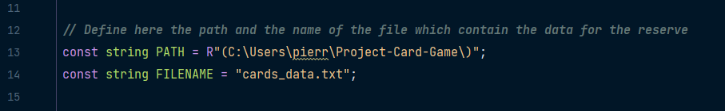
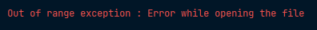
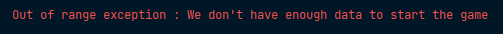

# Project-Card-Game

### Created by <a href="https://github.com/Pierrafrom" target="_blank">Pierre Fromont Boissel</a> and <a href="https://github.com/Samuelito78" target="_blank">Samuel Boix-Segura</a> on January 2023.  

## 🎯 Summary and objectives
The purpose of this project is a to propose a card game. Each card has some specifities according three criteria such as Attack, Defense and Magic.
The game has been realased as guided project for the computer science studends of the IUT of Paris-Saclay university (France). It basically teaches students the object-oriented programming and how to manage and sort Vector data struture in C++. This was a 1 month project made by a team of 2 students: Pierre Fromont and Samuel Boix-Segura. The project has been created from december 2022 to January 2023.

## 🖥️ Setup
1. You'll need to setup the correct path to be able to use a card loading file. 
Open the file "Card.h".  
Then define the path and the filename in the constants.

2. Debugging mode is also available 
In order to enable it , you need to define TEST constant in main.cpp like this:  
  
In case you do not need the use of debugging fucntions, just comment the constant declaration line.  

## 📃 Rules
Here are the rules of the game :  
- The game is a player versus player game but you can be alone and face a bot.
- Each player has a deck of 20 cards which they took from the same card reserve.
- Each card has a name, an attack, a defense and a magic power.
- Your goal is to reduce the prestige poins of your enemy and to protect yours.
- Each player sorts his deck according to a strategy of his own and plays first card of his deck each turn.  

The winner will be the first to take down the enemy (prestige point to 0) or the one who has the most prestige points when one of the two players run out of cards !

Choose your strategy and your cards wisely knowing that :  
- The player whith the highest attack (physical damages) will decrease the prestige of his
  opponent by the difference between his attack value and the defense value from the other player
- If both of the players have the same attack, no damage for anyone
- If the defender has more defense than the attack value of the other player, the defender
  does not gain any prestige points
- The player having the biggest amount of magical power will reduce
  the prestige of his ennemy by the difference of the magical power of value of the two player  

## 🎮 How to play
1. Choose the number of player 
2. Enter your name
3. Choose how do you want fill your deck
4. Choose how do you want to sort your deck
5. If you're playing alone, choose the difficulty of the bot
6. The game starts automaticly

## ‼️ If you have an error
- If you encounter this error : 
   
  Make sure that you've entered the right path and file name in the constants found on "Card.h"
- If you encounter this error : 
   
  This message is the result of a wrongly formatted input data file. In case you need a sample data file, you can find one on our github project page <a href="https://github.com/Pierrafrom/Project-Card-Game/blob/main/cards_data.txt" target="_blank">cards_data.txt</a> on our project page. In case you want to add your own cards and data just keep in mind that the names of the cards cannot comport a space and that the minimum of cards in the file is 20 in order to run the game without bugs.  
⚠️ The input data file is a csv text file. The 1st field holds the Cards name, 2nd holds an integer for the attack, 3rd for the defense and last for the magic. Their are no limit to the value you can pick, but keep in mind you'll have more fun with values between 0-15.
